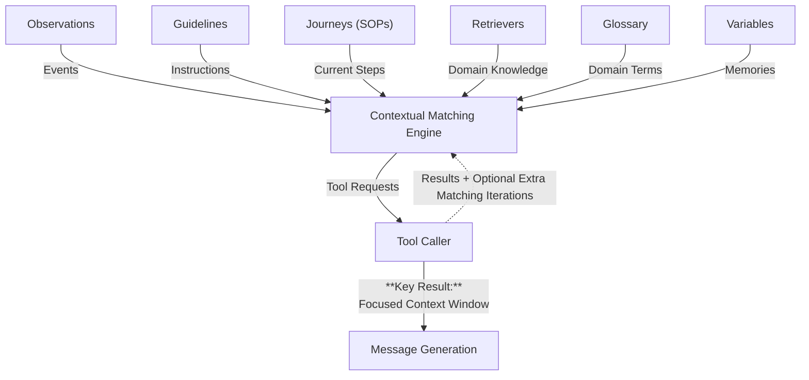
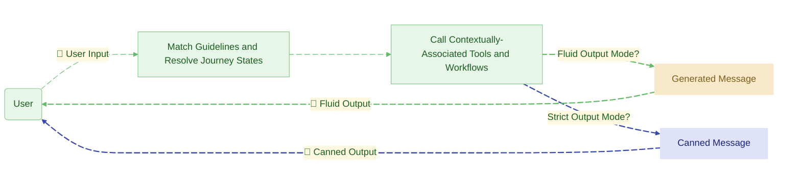

<div align="center">

<picture>
  <source media="(prefers-color-scheme: dark)" srcset="https://github.com/emcie-co/parlant/blob/develop/docs/LogoTransparentLight.png?raw=true">
  
</picture>

### The conversational control layer for customer-facing AI agents

<p>
  <a href="https://pypi.org/project/parlant/"></a>
  
  <a href="https://opensource.org/licenses/Apache-2.0"></a>
  <a href="https://discord.gg/duxWqxKk6J"></a>
  
</p>

<p>
  <a href="https://www.parlant.io/" target="_blank">Website</a> &bull;
  <a href="https://www.parlant.io/docs/quickstart/installation" target="_blank">Quick Start</a> &bull;
  <a href="https://www.parlant.io/docs/quickstart/examples" target="_blank">Examples</a> &bull;
  <a href="https://discord.gg/duxWqxKk6J" target="_blank">Discord</a>
</p>

<p>
  <a href="https://zdoc.app/de/emcie-co/parlant">Deutsch</a> |
  <a href="https://zdoc.app/es/emcie-co/parlant">Español</a> |
  <a href="https://zdoc.app/fr/emcie-co/parlant">français</a> |
  <a href="https://zdoc.app/ja/emcie-co/parlant">日本語</a> |
  <a href="https://zdoc.app/ko/emcie-co/parlant">한국어</a> |
  <a href="https://zdoc.app/pt/emcie-co/parlant">Português</a> |
  <a href="https://zdoc.app/ru/emcie-co/parlant">Русский</a> |
  <a href="https://zdoc.app/zh/emcie-co/parlant">中文</a>
</p>

<a href="https://trendshift.io/repositories/12768" target="_blank">
  
</a>

</div>

&nbsp;

> **Looking for an open-source alternative to Ada, Decagon, or Sierra?**

**Parlant streamlines the development and maintenance of enterprise-grade B2C (business-to-consumer) and sensitive B2B interactions that need to be consistent, compliant, and on-brand.**

## Why Parlant?

Conversational context engineering is hard because real-world interactions are diverse, nuanced, and non-linear.

### ❌ The Problem: What you've probably tried and couldn't get to work at scale
**System prompts** work until production complexity kicks in. The more instructions you add to a prompt, the faster your agent stops paying attention to any of them.

**Routed graphs** solve the prompt-overload problem, but the more routing you add, the more fragile it becomes when faced with the chaos of natural interactions.

### 🔑 The Solution: Context engineering, optimized for conversational control
Parlant solves this with an agentic harness offering optimized [context engineering](https://www.gartner.com/en/articles/context-engineering) for conversational applications: getting the right context, no more and no less, into the prompt at the right time. You define your rules, knowledge, and tools once, while the engine narrows the context down in real-time to what's immediately relevant to each turn of the conversation.


## Design goals

Parlant is built around three goals that shape every decision in the framework:

### 1. Maximum control over the conversation experience

Parlant was designed around a simple idea: developers should be able to control the agent's behavior with precision. In customer-facing conversations, small details matter, like tone, timing, edge cases, policy constraints, and brand voice. So we chose a design that makes these aspects easily configurable and manageable. That approach adds complexity, but it gives teams tighter control over how the agent behaves in real conversations.

### 2. Maximum prevention of unwanted behaviors

Parlant treats misalignment as a core design problem. It builds on [research into model accuracy and consistency](https://arxiv.org/abs/2503.03669#:~:text=We%20present%20Attentive%20Reasoning%20Queries%20%28ARQs%29%2C%20a%20novel,in%20Large%20Language%20Models%20through%20domain-specialized%20reasoning%20blueprints.) so that it is structurally harder for the agent to behave outside its intended boundaries, and easier to detect and correct when it does. Rather than bolting guardrails onto the output, Parlant applies constraints and control points into how your LLMs are used in the first place to produce safe and correct output.

### 3. Fastest path from product feedback to implementation

Parlant seeks to allow those responsible for the agent's conversational experience  to shape its behavior in an intuitive manner, enabling a rapid feedback cycle that engineers can accomodate. Parlant is designed to allow you to incorporate ongoing product feedback as quickly as possible, without manual rewiring of graphs or fine-tuning of models, ensuring that valuable engineering time is only needed for deeper changes, not minor adjustments.

## Getting started

```bash
pip install parlant
```

```python
import parlant.sdk as p

async with p.Server():
    agent = await server.create_agent(
        name="Customer Support",
        description="Handles customer inquiries for an airline",
    )

    # Evaluate and call tools only under the right conditions
    expert_customer = await agent.create_observation(
        condition="customer uses financial terminology like DTI or amortization",
        tools=[research_deep_answer],
    )

    # When the expert observation holds, always respond
    # with depth. Set the guideline to automatically match
    # whenever the observation it depends on holds...
    expert_answers = await agent.create_guideline(
        matcher=p.MATCH_ALWAYS,
        action="respond with technical depth",
        dependencies=[expert_customer],
    )

    beginner_answers = await agent.create_guideline(
        condition="customer seems new to the topic",
        action="simplify and use concrete examples",
    )

    # When both match, beginners wins. Neither expert-level
    # tool-data nor instructions can enter the agent's context.
    await beginner_answers.exclude(expert_customer)
```

Follow the **[5-minute quickstart](https://www.parlant.io/docs/quickstart/installation)** for a full walkthrough.

## Parlant at a glance

You define your agent's behavior in code (not prompts), and the engine dynamically narrows the context on each turn to only what's immediately relevant, so the LLM stays focused and your agent stays aligned.



Instead of sending a large system prompt followed by a raw conversation to the model, Parlant first assembles a focused context — matching only the instructions and tools relevant to each conversational turn — then generates a response from that narrowed context.



In this way, adding more rules makes the agent smarter, not more confused — because the engine filters context relevance, not the LLM.

## Is Parlant for you?

Parlant is built for teams that need their AI agent to behave reliably in front of real customers. It's a good fit if:

- You're building a **customer-facing agent** — support, sales, onboarding, advisory — where tone, accuracy, and compliance matter.
- You have **dozens or hundreds of behavioral rules** and your system prompt is buckling under the weight.
- You're in a **regulated or high-stakes domain** (finance, insurance, healthcare, telecom) where every response needs to be explainable and auditable.

**_Parlant is deployed in production at the most stringent organizations, including banks._**

> _Parlant isn't just a framework. It's a high-level software that solves the conversational modeling problem head-on._
> — **Sarthak Dalabehera**, Principal Engineer, Slice Bank

> _By far the most elegant conversational AI framework that I've come across._
> — **Vishal Ahuja**, Senior Lead, Applied AI, JPMorgan Chase

> _Parlant dramatically reduces the need for prompt engineering and complex flow control. Building agents becomes closer to domain modeling._
> — **Diogo Santiago**, AI Engineer, Orcale

## Features

- **[Guidelines](https://parlant.io/docs/concepts/customization/guidelines)** —
  Behavioral rules as condition-action pairs; the engine matches only what's relevant per turn.

- **[Relationships](https://parlant.io/docs/concepts/customization/relationships)** —
  Dependencies and exclusions between guidelines to keep the context narrow and focused.

- **[Journeys](https://parlant.io/docs/concepts/customization/journeys)** —
  Multi-turn SOPs that adapt to how the customer actually interacts.

- **[Canned Responses](https://parlant.io/docs/concepts/customization/canned-responses)** —
  Pre-approved response templates that eliminate hallucination at critical moments.

- **[Tools](https://parlant.io/docs/concepts/customization/tools)** —
  External APIs and workflows, triggered only when their observation matches.

- **[Glossary](https://parlant.io/docs/concepts/customization/glossary)** —
  Domain-specific vocabulary so the agent understands customer language.

- **[Explainability](https://parlant.io/docs/advanced/explainability)** —
  Full OpenTelemetry tracing — every guideline match and decision is logged.

## [Guidelines](https://parlant.io/docs/concepts/customization/guidelines)

Behavioral rules as condition-action pairs: when the condition applies, the action kicks into context.

Instead of cramming all guidelines in a single prompt, the engine evaluates which ones apply on each conversational turn and only includes the relevant ones in the LLM's context.

This lets you define hundreds of guidelines without degrading adherence.

```python
await agent.create_guideline(
    condition="customer uses financial terminology like DTI or amortization",
    action="respond with technical depth — skip basic explanations",
)
```

## [Relationships](https://parlant.io/docs/concepts/customization/guidelines)

Relationships between elements help you keep the final context just right: narrow and focused.

**Exclusion** relationships keep certain guidelines out of the model's attention when conflicting ones are matched.

```python
for_experts = await agent.create_guideline(
    condition="customer uses financial terminology",
    action="respond with technical depth",
)

for_beginners = await agent.create_guideline(
    condition="customer seems new to the topic",
    action="simplify and use concrete examples",
)

# In conflicting reads of the customer, set which takes priority
await for_beginners.exclude(for_experts)
```

**Dependency** relationships ensure a guideline only activates when another one has set the stage, helping you create _topic-based guideline hierarchies._

```python
suspects_fraud = await agent.create_observation(
    condition="customer suspects unauthorized transactions on their card",
)

await agent.create_guideline(
    condition="customer wants to take action regarding the transaction",
    action="ask whether they want to dispute the transaction or lock the card",
    # Only activates when fraud suspicion has been established
    dependencies=[suspects_fraud],
)
```

## [Journeys](https://parlant.io/docs/concepts/customization/journeys)

Multi-turn SOPs (Standard Operating Procedures). Define a flow for processes like booking, troubleshooting, or onboarding. The agent follows the flow but adapts — it can fast-forward states, revisit earlier ones, or adjust pace based on how the customer interacts.

```python
journey = await agent.create_journey(
    title="Book Flight",
    description="Guide the customer through flight booking",
    conditions=["customer wants to book a flight"],
)

t0 = await journey.initial_state.transition_to(
    # Instruction to follow while in this state (could be multiple turns)
    chat_state="See if they're interested in last-minute deals",
)

# Branch A - not interested in deals
t1 = await t0.target.transition_to(
    chat_state="Determine where they want to go and when",
    condition="They aren't interested",
)

# Branch B - interested in deals
t2 = await t0.target.transition_to(
    tool_state=load_latest_flight_deals,
    condition="They are",
)

t3 = await t1.target.transition_to(
    chat_state="List deals and see if they're interested",
)
```

## [Canned Responses](https://parlant.io/docs/concepts/customization/canned-responses)

At critical moments or conversational events, limit the agent to using only pre-approved response templates.

After running the matching sequence and drafting a message to the customer, the agent selects the template that best matches its generated draft instead of sending it directly, eliminating hallucination risk entirely and keeping wording exact to the letter.

```python
await agent.create_guideline(
    condition="The customer discusses things unrelated to our business"
    action="Tell them you can't help with that",
    # Strict composition mode triggers when this guideline
    # matches - the rest of the agent stays fluid
    composition_mode=p.CompositionMode.STRICT,
    canned_responses=[
        await agent.create_canned_response(
            "Sorry, but I can't help you with that."
        )
    ],
    priority=100,  # Top priority, focuses the agent on this alone
)
```

## [Tools](https://parlant.io/docs/concepts/customization/tools)

Tools activate only when their observation matches; they don't sit in the context permanently. This prevents the false-positive invocations that plague traditional LLM tool setups.

```python
@p.tool
async def query_docs(context: p.ToolContext, user_query: str) -> p.ToolResult:
    results = search_knowledge_base(user_query)
    return p.ToolResult(results)

await agent.create_observation(
    condition="customer asks about service features",
    tools=[query_docs],
)
```

Tools can also feed custom values into canned response templates.

## [Glossary](https://parlant.io/docs/concepts/customization/glossary)

Domain-specific vocabulary for your agent. Map colloquial terms and synonyms to precise business definitions so the agent understands customer language.

```python
await agent.create_term(
    name="Ocean View",
    description="Room category with direct view of the Atlantic",
    synonyms=["sea view", "rooms with a view to the Atlantic"],
)
```

## [Explainability](https://parlant.io/docs/advanced/explainability)

Every decision is traced with OpenTelemetry. Parlant ships out of the box with elaborate logs, metrics, and traces.

## Framework Integration

Parlant handles conversational governance; it doesn't replace your existing stack.

Use it alongside frameworks like LangGraph, Agno, LlamaIndex, or others for workflow automation and knowledge retrieval. Parlant takes over the behavioral control layer while your framework of choice handles the rest of your agent's processing logic.

Any external workflow or agent becomes a Parlant tool, triggered only when relevant:

```python
from my_workflows import refund_graph  # a compiled LangGraph StateGraph

@p.tool
async def run_refund_workflow(
  context: p.ToolContext,
  order_id: str
) -> p.ToolResult:
    result = await refund_graph.ainvoke({"order_id": order_id})

    # Graph result can inject both data and instructions into the agent.
    # Instructions are transformed to guidelines, and participate
    # in contextual guideline resolution (including prioritizations)

    return p.ToolResult(
        data=result["data"],
        # Inject dynamic guidelines from workflow result
        guidelines=[
            {"action": inst, "priority": 3} for inst in result["instructions"]
        ],
    )

await agent.create_observation(
    condition="customer wants to process a refund",
    tools=[run_refund_workflow],
)
```

The same pattern works with LlamaIndex query engines, Agno agents, or any async Python function.

## LLM Agnostic

Parlant works with most LLM providers. The recommended ones are [Emcie](https://www.emcie.co) which delivers an ideal cost/quality value since it's built specifically for Parlant, but OpenAI and Anthropic deliver excellent quality outputs as well. You can also use any model and provider via LiteLLM, but they need to be good ones - off-the-shelf models which are too small tend to produce inconsistent results.

Generally, you can swap models without changing behavioral configuration.

## [Official React Chat Widget](https://github.com/emcie-co/parlant-chat-react)

Drop-in chat component to get a frontend running immediately.

## Learn more

- **[How Parlant ensures compliance](https://www.parlant.io/blog/how-parlant-guarantees-compliance)** — deep dive into the engine
- **[Parlant vs LangGraph](https://www.parlant.io/blog/parlant-vs-langgraph)** — when to use which
- **[Parlant vs DSPy](https://www.parlant.io/blog/parlant-vs-dspy)** — different tools for different problems

## Community

- **[Discord](https://discord.gg/duxWqxKk6J)** — ask questions, share what you're building
- **[GitHub Issues](https://github.com/emcie-co/parlant/issues)** — bug reports and feature requests
- **[Contact](https://parlant.io/contact)** — reach the engineering team directly

**If Parlant helps you build better agents, **[give it a star](https://github.com/emcie-co/parlant)** — it helps others find the project.**

## License

Apache 2.0 — free for commercial use.

---

<div align="center">

**[Try it now](https://www.parlant.io/docs/quickstart/installation)** &bull; **[Join Discord](https://discord.gg/duxWqxKk6J)** &bull; **[Read the docs](https://www.parlant.io/)**

Built by the team at **[Emcie](https://emcie.co)**

</div>
